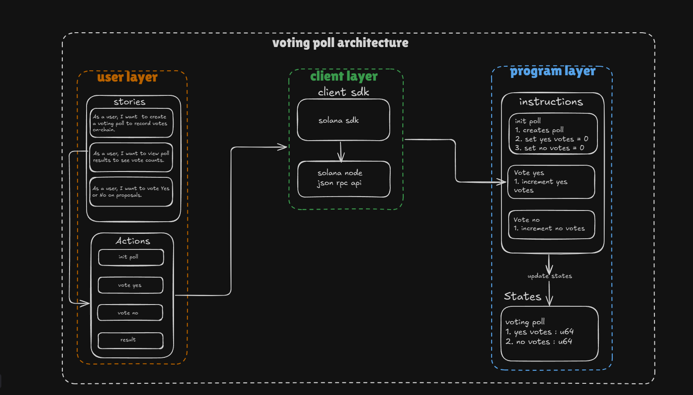

# 🗳️ Voting-Poll

Voting-Poll is a simple on-chain voting program built on Solana using Anchor. Users can create voting polls and cast yes/no votes transparently on-chain, demonstrating how counter-based logic can be used for real-world voting use cases.

## User Stories
- As a user, I want to create a voting poll, so that others can vote on a proposal.
- As a user, I want to vote "Yes" on a poll, so that my support is recorded on-chain.
- As a user, I want to vote "No" on a poll, so that my opposition is recorded on-chain.
- As a user, I want to view the poll results, so that I can see how many yes and no votes have been cast.

## Architectural Diagram



*Architecture showing the three-layer structure: User Layer (stories & actions), Client Layer (SDK & RPC), and Program Layer (instructions and states).*

## Setup & Usage

> **Prerequisites:** Ensure you're on the Solana localnet environment.

### 1. Clone the repository
```bash
git clone https://github.com/kiralightyagami/voting_poll
cd voting_poll
```

### 2. Install dependencies

> ⚠️ **Important:** Don't skip this step — tests won't run without it.
```bash
yarn install
```

### 3. Build the program
```bash
anchor build
```

### 4. Run tests
```bash
anchor test
```

## Features

- **Initialize Poll**: Create a new voting poll with yes/no vote counters set to zero.
- **Vote Yes**: Cast a "yes" vote, incrementing the yes counter.
- **Vote No**: Cast a "no" vote, incrementing the no counter.
- **Query Results**: Check vote counts at any time without transaction fees.

## Program Architecture

### State (`state.rs`)
```rust
pub struct VotingPoll {
    pub yes_votes: u64,
    pub no_votes: u64,
}
```
Simple state management using counter pattern for tracking votes.

### Instructions

#### `initialize.rs`
- Creates a new voting poll account
- Initializes vote counters to 0

#### `vote.rs`
- `vote_yes`: Increments the yes vote counter
- `vote_no`: Increments the no vote counter

## Use Case

This voting contract demonstrates how simple counter logic can be applied to real-world scenarios. Each vote is essentially an increment operation on a counter, making it a perfect example of how fundamental programming concepts translate to blockchain applications.

## Security

- All vote counts are stored and verified on-chain through Solana's program logic.
- Transparent and immutable voting records.

## Future Enhancements

Potential improvements could include:
- Vote weight/token-gated voting
- One-vote-per-wallet enforcement
- Time-bound polls with start/end dates
- Multiple choice options beyond yes/no
- Proposal descriptions stored on-chain
